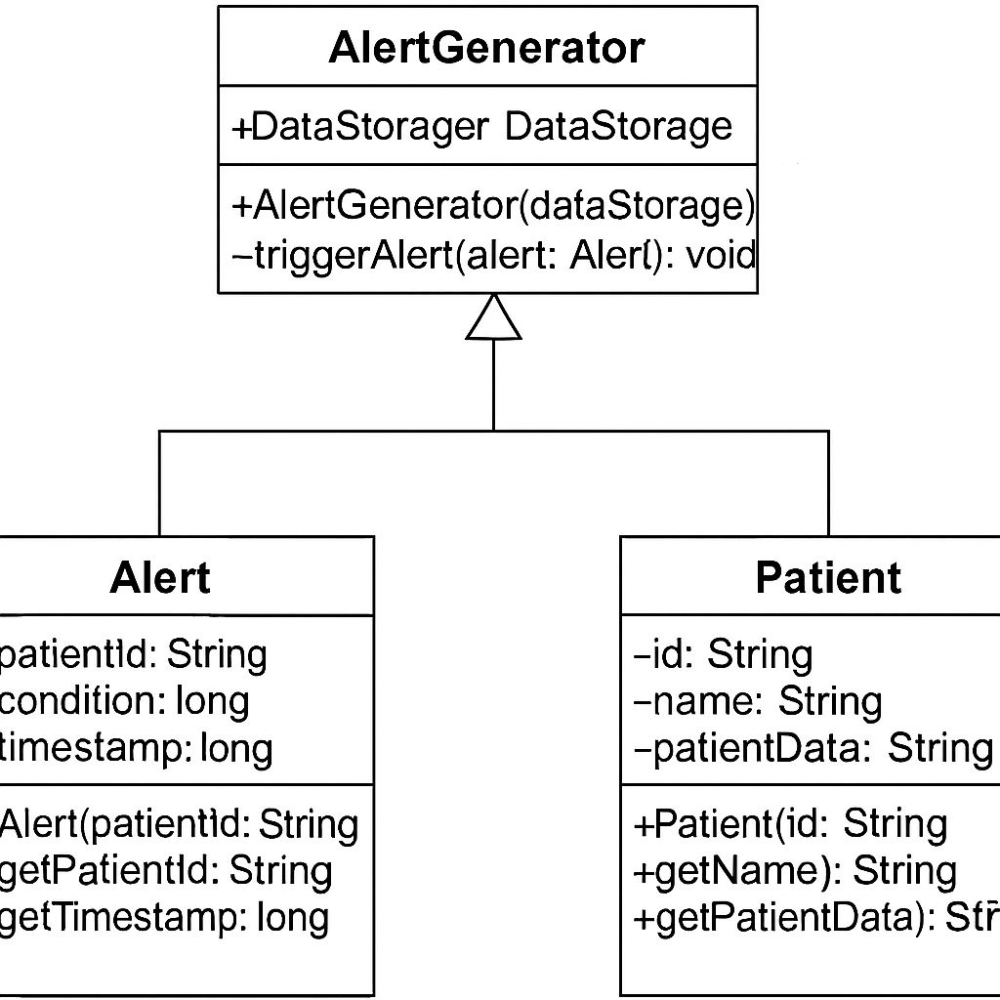
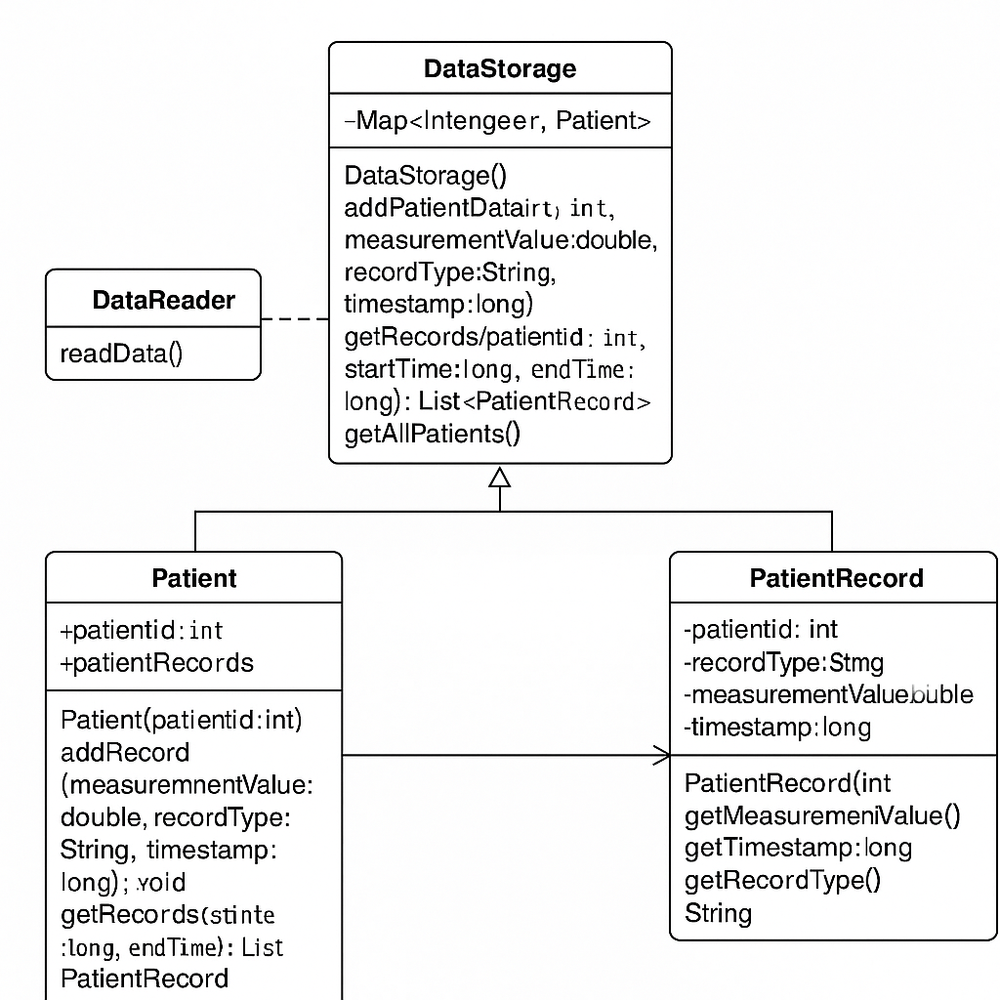
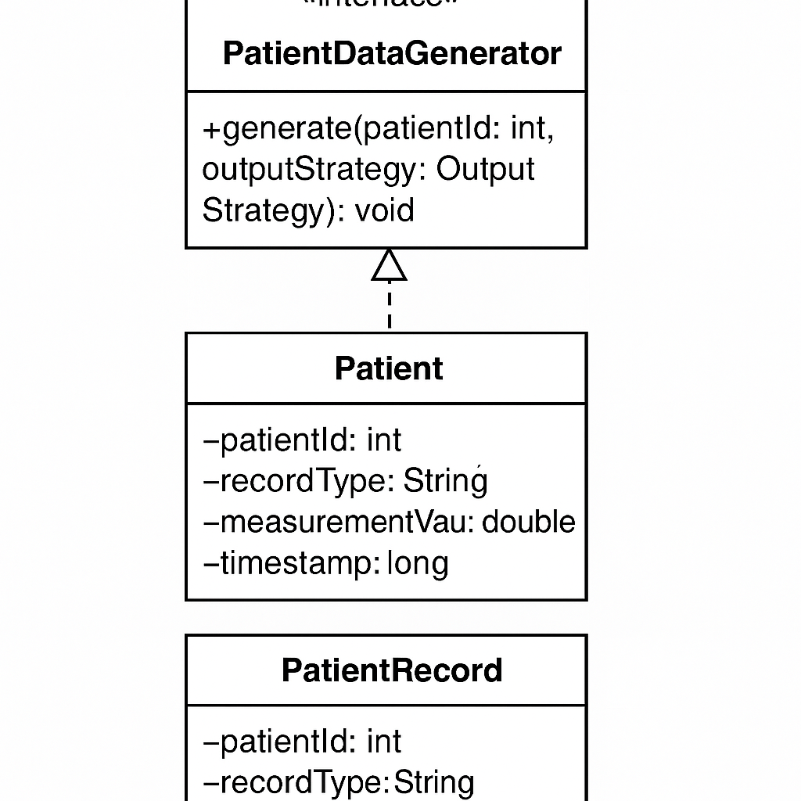
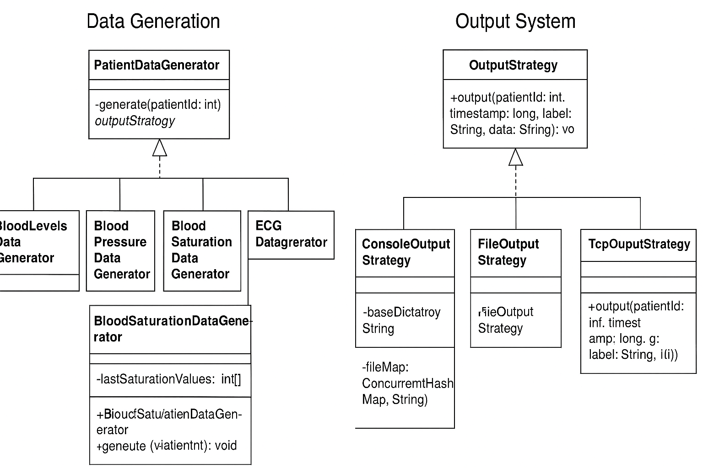

# UML Models and Design Documentation

This folder contains UML class diagrams and system design explanations for the CHMS (Cardiovascular Health Monitoring System) developed as part of SE Project Week 2.

## 1. Alert Generation System

### Classes
- `Alert`
- `AlertGenerator`
- `Patient`

### Key Relationships
- `AlertGenerator` generates alerts based on specific conditions.
- `Patient` represents the individual receiving alerts.
- `Alert` represents an individual alert related to a patient.

### Explanation
The alert generation system monitors patient data and generates alerts based on predefined conditions. When a condition is met, an alert is created, which includes the patient ID, timestamp, and alert type. This system is crucial for notifying healthcare providers of critical patient conditions.



---

## 2. Data Storage System

### Classes
- `DataStorage`
- `Patient`
- `PatientRecord`

### Key Relationships
- `DataStorage` maintains a history of patient `PatientRecord` entries.
- `Patient` represents the individual whose records are stored.
- `PatientRecord` holds the data measurements (e.g., heart rate, blood pressure).

### Explanation
This system is responsible for managing and accessing patient health data. The `DataStorage` class stores records, while `Patient` and `PatientRecord` manage individual data points for each patient.



---

## 3. Patient Identification System

### Classes
- `Patient`

### Key Relationships
- `Patient` represents the individual, storing their medical data.

### Explanation
The identification system ensures that each patient's health data is correctly tracked and associated with the appropriate patient identity. In this case, `Patient` acts as the primary class responsible for holding and managing patient-related data.



---

## 4. Data Generation and Output System

### Classes
- `PatientDataGenerator`
- `BloodSaturationDataGenerator`
- `BloodPressureDataGenerator`
- `FileOutputStrategy`
- `ConsoleOutputStrategy`
- `TcpOutputStrategy`
- `WebSocketOutputStrategy`

### Key Relationships
- `PatientDataGenerator` is implemented by generator classes like `BloodSaturationDataGenerator`.
- `OutputStrategy` is implemented by classes like `FileOutputStrategy`, allowing data to be written to different output destinations.
- This system shows how data generation and output strategies are linked.

### Explanation
This system generates patient data (e.g., blood saturation, blood pressure) and outputs it to various destinations (e.g., file, console, TCP, WebSocket). It provides a modular and extensible design to add new types of data generation and output handling.



---

## Integration Instructions

1. Place diagram images (e.g., `.drawio` or `.png`) in this `uml_models/` folder.
2. Ensure this file (`README.md`) is stored in the same directory.
3. Update the main `README.md` in the root of the repository to include a reference to this folder:

```markdown
## UML Models
See class diagrams and documentation in [uml_models](./uml_models/)
